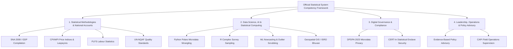

# KASHYAP-STAT: AI-Enabled Skill Intelligence & Personalized Learning Platform

An enterprise-grade, AI-powered Skill Intelligence, Competency Gap Analysis, and Personalized Learning Platform designed specifically for **India's Official Statistical System** (Ministry of Statistics and Programme Implementation - **MoSPI**, **NSSTA**, and State DES), seamlessly integrated with the **iGOT Karmayogi** ecosystem and **NSSTA TPAC** training frameworks.

---

## 1. Executive Summary & Problem Context

India's Official Statistical System is modernizing rapidly with the adoption of **Computer Assisted Personal Interviewing (CAPI)**, **AI/ML Automated Data Scrubbing**, **High-Frequency Economic Nowcasting**, **Geospatial Survey Stratification (ISRO Bhuvan)**, and **Cloud Data Lakes (NIC MeghRaj)**. However, statistical officers across the **Indian Statistical Service (ISS)** and **Subordinate Statistical Service (SSS)** often face challenges in identifying relevant upskilling pathways aligned with their specific assignments and evolving domain needs.

**KASHYAP-STAT** solves this by delivering:
1. **Automated Competency Gap Profiling**: Maps 28 official statistical units across 4 core domains against target cadre benchmarks.
2. **Dual-Track Hybrid Recommendation Engine**: Integrates 60+ **iGOT Karmayogi digital micro-courses** with 15+ **NSSTA TPAC in-service residential programmes**.
3. **AI-Powered Assessment & Generative MCQ Engine**: Ingests uploaded official manuals, survey guidelines, and circulars to synthesize high-quality objective MCQs with **pedagogical explanations**, **source citations**, and **real-time competency score calibration**.
4. **Dual-Cockpit Interactive Dashboard**: Modern UI for individual learners (Competency Passport, Gap Matrix, Quiz Arena, Learning Paths, AI Assistant) and MoSPI Cadre Administrators (National Heatmaps, Skill Deficit Alerts, Capacity Forecasting).

---

## 2. Competency Framework Taxonomy (4 Domains, 28 Units)



### Domain 1: Official Statistical Methodologies & National Frameworks (35% Weight)
* **STAT-01**: Survey Sampling & Multi-Stage Research Design (Stratified Cluster, Multipliers)
* **STAT-02**: National Accounts & GDP Compilation (SNA 2008, Supply-Use Tables - SUT, GVA at basic prices)
* **STAT-03**: Price Statistics & Inflation Indices (CPI Rural/Urban/Combined, Laspeyres, Jevons geometric mean)
* **STAT-04**: Industrial Statistics & Annual Survey of Industries (ASI, Index of Industrial Production - IIP)
* **STAT-05**: Labour Market Dynamics & Periodic Labour Force Surveys (PLFS, UPSS, CWS, Rotational Panel)
* **STAT-06**: Agricultural Statistics, Land-Use & Crop Forecasting (GCES, Remote Sensing)
* **STAT-07**: SDG Indicators & National Indicator Framework (NIF 3.0, Disaggregation)
* **STAT-08**: National Quality Assurance Framework (UN-NQAF, Process Quality, Error Prevention)
* **STAT-09**: Statistical Metadata & Microdata Dissemination (DDI, SDMX Standards)
* **STAT-10**: UN Fundamental Principles of Official Statistics & Ethics

### Domain 2: Modern Data Science, AI & Statistical Computing (30% Weight)
* **TECH-01**: Python for Statistical Computing & Survey Processing (Polars, Pandas, Zero-Copy Reads)
* **TECH-02**: R for Advanced Statistical Inference & Econometrics (`survey`, `srvyr` packages)
* **TECH-03**: SQL, Modern Data Warehouses & Automated ETL (ClickHouse, PostgreSQL, MeghRaj)
* **TECH-04**: Econometric & Survey Modeling Packages (Stata, SPSS, CSPro CAPI)
* **TECH-05**: Geospatial Analytics & Spatial Statistics (QGIS, ISRO Bhuvan, Spatial Weights)
* **TECH-06**: Modern Data Visualization & Interactive Storytelling (Apache ECharts, PowerBI)
* **TECH-07**: Machine Learning, Nowcasting & Anomaly Detection in Official Surveys
* **TECH-08**: Cloud Data Architecture & Government Cloud (NIC MeghRaj, REST APIs)

### Domain 3: Digital Public Infrastructure, Security & Compliance (15% Weight)
* **GOV-01**: Cybersecurity & CERT-In Compliance for Statistical Enclaves
* **GOV-02**: Data Privacy, DPDPA 2023 & Statistical Confidentiality (k-Anonymity >= 5, Top-Coding)
* **GOV-03**: Digital Public Infrastructure (DPI), Data Exchanges & API Economy
* **GOV-04**: Government Procurement & Asset Governance (GeM, GFR 2017)
* **GOV-05**: Digital Office Systems & Paperless Administration (e-Office)

### Domain 4: Leadership, Operations & Policy Advisory (20% Weight)
* **LEAD-01**: Strategic Statistical Leadership & Evidence-Based Policy Advisory
* **LEAD-02**: Field Survey Administration & Nationwide Operations Control (FOD CAPI Inspections)
* **LEAD-03**: Statistical Communication, Media Briefing & Combating Misinformation
* **LEAD-04**: Project Portfolio Management & Flash Reporting Timelines
* **LEAD-05**: Inter-Ministerial Statistical Coordination & Cross-Departmental Harmonization

---

## 3. Dual-Track Hybrid Recommendation Engine

The recommendation engine dynamically analyzes an officer's skill gap vector:
$$\text{Gap}_{i,j} = \max(0, \text{TargetLevel}_{r,j} - \text{CurrentLevel}_{i,j}) \times w_j$$
$$\text{Competency Index}_i = 100 \times \left(1 - \frac{\sum_j \text{Gap}_{i,j}}{\sum_j \text{TargetLevel}_{r,j} w_j}\right)$$

### Track A: iGOT Karmayogi Digital Micro-Courses
* **3-Stage Structured Trajectory**:
  * **Stage 1 (Urgent Gap Remediation)**: High-severity deficits impacting core assignments.
  * **Stage 2 (Applied Modernization)**: Data science, AI/ML nowcasting, and DPDPA compliance.
  * **Stage 3 (Strategic Leadership)**: Executive communication, media briefing, and policy advisory.
* **Integrated Features**: 1-Click Fast-Track Enrolment, live Karma Points accrual, and immediate competency uplift.

### Track B: NSSTA TPAC In-Service Flagship Programmes
* Matches officers to annual residential and hybrid workshops at NSSTA Greater Noida, IIT Delhi, and regional training centers (e.g. 5-Day National Accounts Lab, 2-Week AI/ML Immersion).

---

## 4. AI-Powered Intelligent Assessment Engine

* **Document Parsing**: Ingests PDF, Markdown, and Text files (e.g., SNA 2008 manual, CPI guidelines, PLFS concepts, Python data guide, DPDPA 2023).
* **Generative Question Typologies**:
  * Single-Answer Conceptual MCQs
  * Practical Computational & Formula Questions
  * Official Statistics Field Dilemma Case Studies
  * Assertion & Reasoning Items
* **Instant Pedagogical Feedback**: Provides detailed explanations for *why* the right answer is correct and *why* distractors fail, citing specific source paragraphs.
* **Live Competency Radar Recalibration**: Completing assessments automatically adjusts the officer's live skill radar and records verified capability progress.

---

## 5. REST API Architecture (Port 8050)

| HTTP Method | Endpoint | Description |
| :--- | :--- | :--- |
| `GET` | `/api/framework` | Returns full 4-domain 28-unit Competency Framework taxonomy |
| `GET` | `/api/learner-profile` | Returns active officer profile, scores, and gaps |
| `GET` | `/api/recommendations` | Returns personalized iGOT & NSSTA recommended pathways |
| `GET` | `/api/igot/courses` | Search and filter the full iGOT Karmayogi catalog |
| `POST` | `/api/igot/enrol` | Simulates course completion, awarding Karma & updating scores |
| `GET` | `/api/materials` | Retrieves preloaded MoSPI knowledge modules |
| `POST` | `/api/assessments/generate` | Generates AI MCQs from custom or preset text |
| `POST` | `/api/assessments/submit` | Evaluates answers, provides explanations & updates skill radar |
| `GET` | `/api/admin/analytics` | Macro division heatmaps, deficit rankings & capacity forecast |
| `POST` | `/api/assistant/query` | Statistical assistant RAG answering official queries |

---

## 6. How to Run Locally

### Quick Launch
1. In PowerShell, navigate to the folder:
   ```powershell
   cd d:\SIH\101
   ```
2. Run the master pipeline:
   ```powershell
   .venv\Scripts\python.exe run_pipeline.py
   ```
3. Open the portal in your browser at:
   👉 **[http://localhost:8050/](http://localhost:8050/)**

---

## 7. Interactive Portal Features

* **Role Switcher**: Switch between Director (NAD - ISS), DDG (SDRD), Deputy Director (ESD), Assistant Director (SSD), Senior Statistical Officer (SSS - FOD), Junior Statistical Officer (SSS), State DES Joint Director, and Line Ministry Statistical Advisor.
* **Interactive Radar Chart**: Compare current assessed capabilities against cadre benchmarks across 4 domains.
* **Interactive AI Assessment Arena**: Ingest any circular/manual, take timed tests with instant feedback, and observe live radar score uplifts.
* **MoSPI Cadre Administration**: Inspect nationwide division heatmaps, 2,850+ officer records, and predictive 2026-2030 training forecasts.
* **Floating AI Karmayogi Assistant**: Click the bot icon in the bottom-right corner to interact with the natural language statistical query engine.
